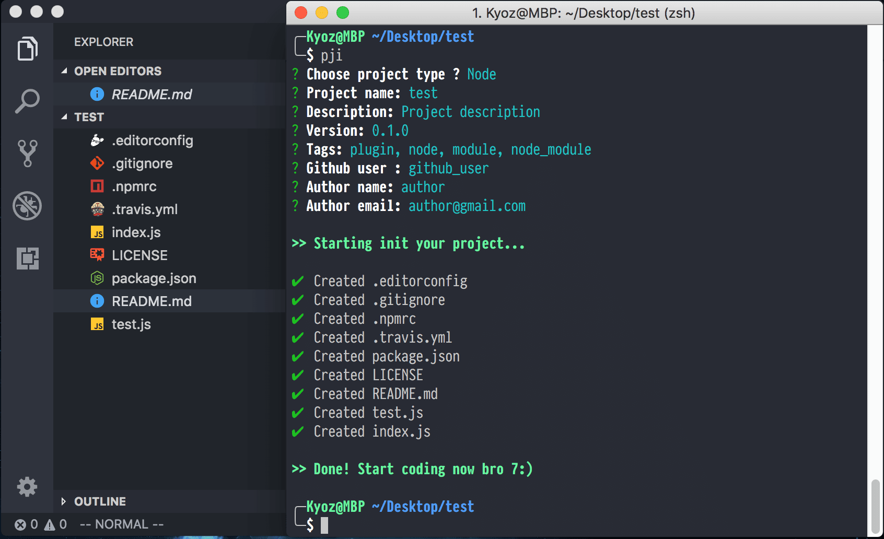

# pji 

> Init node project

[](https://travis-ci.org/banminkyoz/pji) [](http://badge.fury.io/js/pji) [](https://github.com/xojs/xo)

<p align="center">
  
</p>

## Features

- Create node, node cli project fast, easily
- Use [XO](https://github.com/xojs/xo) as linter
- Use [AVA](https://github.com/avajs/ava) as test runner

## Install

```
$ npm install -g pji
```

## Usage

```
$ pji
```

## Related

- [chalk](https://github.com/chalk/chalk) - Terminal string styling done right
- [inquirer](https://github.com/SBoudrias/Inquirer.js) - A collection of common interactive CLI
- [ejs](https://github.com/tj/ejs) - Embedded JavaScript templates for node
- [underscore.string](https://github.com/epeli/underscore.string) - String manipulation helpers for js

## License

MIT © [Kyoz](mailto:banminkyoz@gmail.com)

